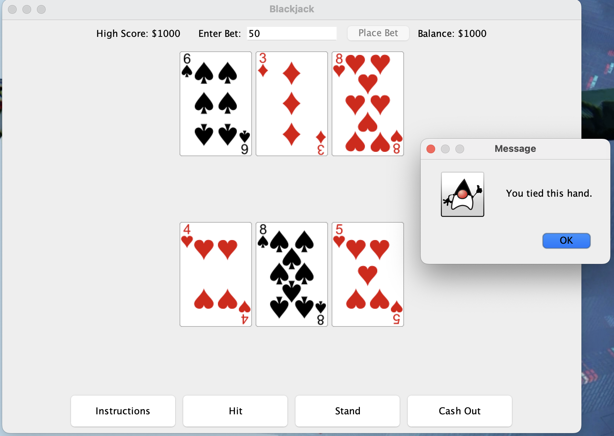

# Blackjack Game - Java GUI Version

This is a Java-based **Blackjack** game that utilizes a graphical user interface (GUI) for an engaging and interactive user experience. The game follows the standard rules of Blackjack, allowing players to place bets, hit, stand, and compete against the dealer. Additionally, it features a high-score tracking system.

## Features

- **Interactive GUI**: The game features a clean and responsive graphical interface using **Java Swing**.
- **High Score Tracking**: Keeps track of the highest score and saves it to a file for persistence.
- **Betting System**: Allows players to place bets and manage their balance.
- **Blackjack Rules**: Supports standard Blackjack rules such as *Five-Card Charlie* and *dealer stands at 17*.
- **Welcome Screen**: A visually appealing welcome screen with game instructions.
- **Custom Card Images**: Displays cards using image files for enhanced visuals.

## Gameplay Instructions

1. **Welcome Screen**
   - A welcome screen appears when you launch the game.
   - Click "Let's Play!" to start.

2. **Placing a Bet**
   - Enter a bet amount in the provided field.
   - Your balance starts at **$1000**.
   - Click the "Place Bet" button to begin a round.

3. **Player Actions**
   - Once the round begins, you can:
     - **Hit**: Draw another card.
     - **Stand**: End your turn and let the dealer play.

4. **Dealer's Turn**
   - The dealer automatically plays after you stand, drawing cards until reaching **17 or more**.

5. **Round Outcome**
   - **Player Wins**: If the player achieves Blackjack (21) or a higher score than the dealer without busting.
   - **Dealer Wins**: If the dealer has a higher score or the player busts.
   - **Tie**: If both player and dealer scores are equal.

6. **Game Progression**
   - If your balance reaches $0, the game resets.
   - Your high score and statistics are saved automatically.
     
## Screenshots
### Game Example 1


### Game Example 2


### Game End Screen


### Title Screen


## Requirements

- **Java Development Kit (JDK)**: Ensure that JDK 8 or higher is installed.
- **Card Images**: Custom card images are stored in the `src/Images/PNG-cards-1.3/` directory.
- **High Score File**: The game creates a file named `high_score.txt` to store the player's high score.

## How to Run the Game

1. Clone or download the project source code.
2. Ensure the `src` folder contains the card images under `src/Images/PNG-cards-1.3/`.
3. Compile and run the program using the following commands:
   ```bash
   javac BlackjackGame.java BlackjackGUI.java
   java BlackjackGUI
   ```

## File Structure

```
/ProjectRoot
|-- src/
|   |-- BlackjackGame.java     # Game logic
|   |-- BlackjackGUI.java      # Graphical User Interface
|   |-- Images/                # Images for cards and backgrounds
|       |-- PNG-cards-1.3/     # Card image assets
|       |-- MrYeeCasinoBackground.jpeg
|-- high_score.txt             # File for storing high scores
```

## Code Overview

### BlackjackGame.java
- Handles the core **Blackjack logic**:
  - Deck initialization, shuffling, and card dealing.
  - Scoring logic with ace adjustment and *Five-Card Charlie* support.
  - Tracks game progress, wins, and losses.
  - Updates and saves the high score.

### BlackjackGUI.java
- Implements the **graphical user interface** using **Java Swing**:
  - Provides buttons for player actions (*Hit*, *Stand*, *Instructions*, *Cash Out*).
  - Displays the dealer and player hands using card images.
  - Manages player betting and balance updates.
  - Shows a welcome screen with a casino-themed background.

## Customization
- You can replace the card images in `src/Images/PNG-cards-1.3/` with your own images.
- The starting balance and high-score file path can be modified in `BlackjackGame.java`.

## Known Issues
- Ensure that the card images directory matches the specified path in the code.
- If `high_score.txt` is deleted, the high score will reset to 0.

